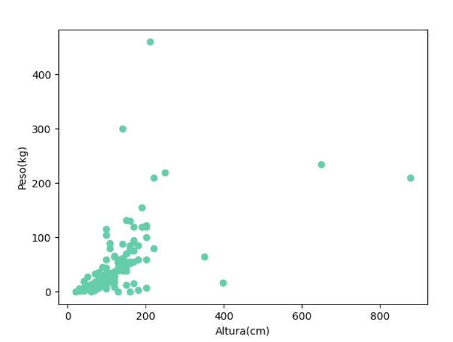
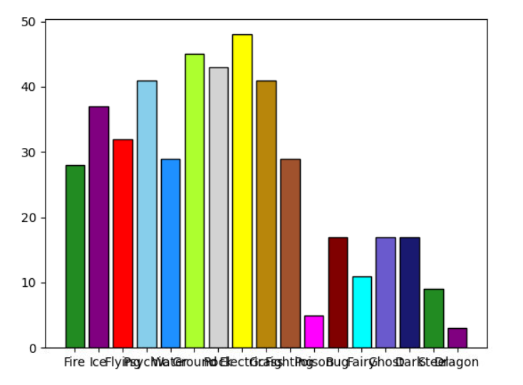
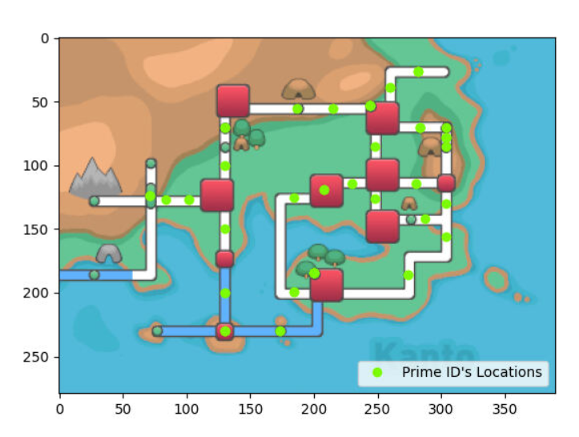
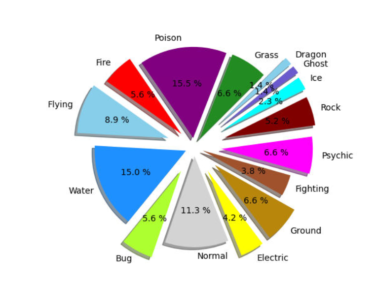

# PC2---ICS
# Vizualización de datos
## ¿De que se trata el proyecto?
En este proyecto, analizaremos algunos datos, en este caso la pokedex regional de Kanto. Vamos a mostrar algunos gráficos con respecto a los datos de los pokemones, como sus debilidades, tipos, ubicación, etc.

#### Integrantes:
 

- Alejandro Gerardo Calizaya Alvarez - 91271621 (ID GitHub)
- Jose Eddison Pinedo Espinoaza - 91136098 (ID GitHub) 
- Fernando Joaquin Pedroza Llantos - 91271625 (ID GitHub)  
- Giovany Junior Ocaña Ramirez - 91271610  (ID GitHub)

## Instrucciones para ejecutar el proyecto
Hemos creado *4 archivos* que contienen, cada uno, una función. En la pantalla de inicio, vamos a pedir al usuario que ingrese una opción para visualizar un gráfico.

### Gráficos
- Scatterplot: Este gráfico nos muestra los pesos y alturas de cada pokemon.

- Barras: Este gráfico nos muestra la cantidad de debilidades de todos los pokemones.

- Mapa Kanto: Este gráfico nos muestra la ubicación de los pokemones con ID Primo

- Pie: Este gráfico nos muestra el porcentaje de cada tipo de pokemon existente en la 1ra Generación

## Link de Replit
https://replit.com/@Alejandro-Gerar/PC2-ICS#main.py
